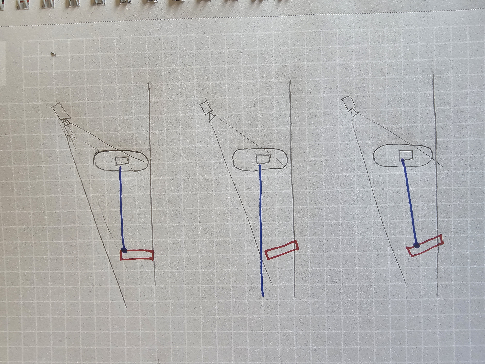

# DH2323 Project Blog

## Wednesday 25/5

### Goal before:

Each person bring 2-3 more ideas or articles on what the project could entail, as a starting point for discussing how to best narrow down the scope of the project and find something achievable within the time frame and our skill set.

### Todays accomplishments

Today we started narrowing down what the project could entail. Both of us brought ideas and research on simple games and game designs that we could work from. Where the main thing that we decided on was a game that isn't as violence coded as the tanks from lab 2 and 3, and that we wanted to implement a more intricate pathfinding, such as A\*. We also put up requirements for the MVP, goals that are the minimum for us to call it a successful project.

## Wednesday 15/6

### Todays accomplishments

The main focus today was setting up the environment and figuring how Unity Cloud works. This was successful, even though Unity Cloud was a bit more frustrating than we imagined. After a bit of effort to get Unity Cloud to work, we focused on getting the camera focused on the player and imported packages with models for the flowers and bugs that hopefully can be used during this project. The bug package that we found though, are in 2D, which is a problem that we will have to figure out during the project. Either by finding a new package with 3D bugs, which wasn't found this time, or making sure that the bugs, even though technically in 2D, are facing the camera.

## Monday 7/7

### Goals of today

Frida will focus on spawning flowers in the game.
Anders will focus on the raycast from the spray bottle that is connected to the player.

### Todays accomplishments

We have today successfully implemented the functionality of spawning flowers randomly in the game. One problem that we will have to solve down the line is implementing so that the flowers can't spawn on top of each other, which is a possibility in the current state. This will probably be solved by implementing a radius of how close the flowers can be to another flower. We also managed to implement the same functionality for bugs, so that they can spawn at random positions.

We have also managed to implement so that the spray bottle, an artifact connected to the player, can deal damage to the bugs, by using a raycast from the bottle and an enemy layer on the bugs. There is no visual representation of the damage taking place for now, but if you spray a bug enough times it will disappear.

We today also fixed the problem where the bugs models are 2D in a 3D environment, by fixing their position to always be rotated against the camera.

This created a problem where the ray from the spray bottle would miss the bugs, since they no longer are perpendicular to the ground. This was solved by angling the ray down a bit so that it would hit the bugs hit box.

This process of aligning bugs towards camera, and in turn, ray towards bug, can be seen in the image below:

## Thursday 10/10

### Goals of today

Frida will research visual representation of health bars and start setting up a system for that. If time allows, Frida will also look into the spawning of flowers to make sure that they are not spawning too close to each other.
Anders will focus on the setup of the pathfinding algorithm and spawning obstacles.

### Todays accomplishments

Today was a very productive day. Anders managed to set up the node grid that will be the base for the A\*-pathfinding algorithm. He also managed to implement obstacles spawning at random locations when the game initializes. The base of the A\* is also set up, although it is not working fully at the moment. This will be Anders' focus during our next session.

Frida worked on a visual representation of the health bars, researching how this could be done graphically. We decided to implement this using a slider, as it could easily be modified and was an, for us, intuitive way of showing the HP of flowers and bugs. She also made sure that the problem were the flowers can spawn on each other, was resolved. The full implementation of HP-system was not completed, as it could not read and by modified connecting to the GameObjects. This will be a focus point for the next session.

## Sunday 13/7

### Goals of today

Frida will focus on getting the health bars implemented so that they properly display damage taken from the player on the bugs and damage taken from the bugs on the flowers.
Anders will focus on finalizing the movement algorithm for the bugs.

### Todays accomplishments

Today, we managed to implement the health bars so that they are properly displaying the health for both flowers and bugs, and that the visual representation is changed when the attributes of each GameObject changes. We also finalized the A\* for the bugs movement. To get all the objects spawning in the correct order, we also formalized a spawn order so that the obstacles spawn first, then the flowers and then the bugs. This to ensure that the flowers can't spawn inside of an obstacle and such.

## Saturday 19/7

### Goals of today

Today we will aim to finalize the last parts of the MVP, which includes making sure that the flowers take damage from bugs if they are in a close range for a certain amount of time and that the bugs find a new flower after they have destroyed/eaten a flower.

### Todays accomplishments

Today we managed to implement that the bugs do damage on the flowers if they are close enough to them for a certain amount of time. We also implemented that when a bug destroys/eats a flower, that they find the closest new flower and start moving towards that. Here we bumped into a problem, where the bug did damage on the new flower even before reaching the new flower after consuming the first flower. This was fixed by resetting the flag "is at flower" to false whenever we enter the "FindClosestFlower"-function in BugAI.cs. With that, we found that the goals for the MVP that we had set up were met and decided to leave our MVP as it was.
