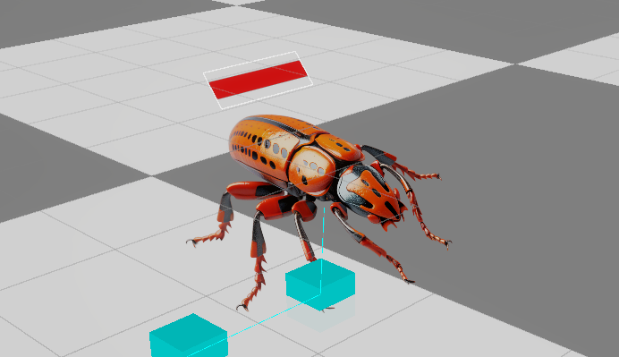

# Project DH2323 Animaiton Track

Project repo for DH2323 Animation track

Project participants: [Frida Andersson](mailto:friande@kth.se) | [Anders Wallenthin](mailto:wallenth@kth.se)

## Concept

Building upon Lab 3 (Animation track) we aimed to create a more complete game experience with; 1. pathfinding, 2. active agents (NPCs having a goal and acting towards it), 3.Communicating states of agents and game objects to user.

## Starting point

Wanting to create something that was both fun to develop and interact with while also being educational for us when working on the project. Having Lab 3 (Animation track) as a base we wanted to change the theme from obvious war associations to something more lighthearted, without necessarily losing the core mechanics of the game. With this we came up with the idea of clearing out bugs from a garden with bug spray. The bugs (NPC agents) should seek out a flower to eat when they spawn, and if they eaten a flower they should seek out a new one.

## Design

The design was not our main focus during this project, leaving many elements as placeholders. Some

### Visual Style

Once again taking inspiration from Lab 3, we choose to keep the semi top-down view. Finding and designing all elements from scratch, we took on a make it work approach meaning that many assets remain as placeholders (eg the player is a capsule and the obstacles are cubes). We found suitable assets for the bugs and flowers from the Unity Asset Store.

Spray can asset was found here: [Maker Tool Set - DIY Crafting Tools](https://assetstore.unity.com/packages/3d/props/tools/maker-tool-set-diy-crafting-tools-229780)

Bug asset can be found here: [Bugs set](https://assetstore.unity.com/packages/2d/bugs-set-270012)

Flower assets are no longer available, but were found by searching "flower" in the Unity Asset Store.

## Implementation

### Movement

The player moves around using WASD which is and aims with the mouse, shooting with left click.

### Spawning

Every gameobject is placed relative to a navigation grid used for pathfinding. This is to be able to mark obstacles, and after obstacles have been spawned, make sure cells are free for flowers to spawn in.
The full spawn order is as follows:

1. Obstacles spawn in random locations and orientations (0 or 90 degrees) on the navigation grid.
2. Flowers spawn in random locations on the navigation grid, avoiding obstacles and other flowers.
3. Bugs spawn in random locations on the navigation grid, avoiding obstacles and flowers.
4. Game starts.

### Pathfinding

Drawing a square grid over the ground plane, each cell is marked as walkable or unwalkable during initialization. The spawned bugs the utilize A\* pathfinding to find the shortest path to their target flower. If a flower despawn (eaten until no hitpoints remain), a new target is assigned and a new path is calculated.

In Unity scene view, the grid can be visualized for debugging purposes, as seen below. Walkable tiles are marked in white, unwalkable tiles (obstacles) in red.

The path each bug is taking is also visualized in scene view during runtime to observe expected behaviour from pathfinding, as seen below. Bug (to the right) is moving towards target flower (to the left) along calculated path (in turquoise). Center of each cell in the path is marked with a small square.

### Health System

Both flowers and bugs have a health system, where flowers lose health when being eaten by bugs, and bugs lose health when being sprayed by the player. When health reaches zero, the game object despawns. A visual representation of a objects current health is shown above the object as a health bar. It is oriented towards the camera in the same way as the bugs. Examples of spawned flower and bug with health bars can be seen below. Flower health bar is green, bug health bar is red (to further communicate opponents vs what is to be protected).

 

## Deployment

A build of the game can be found in the [Project Build](ProjectBuild.zip) zip file. To run the game, first download the zip file, then unzip and run the _DH2323 - Project.exe_ executable inside the _Build_ folder. To exit the game, press `ALT + F4`.

## Documentation

The whole developing process is documented in our [project blog](Blog.md). A [project rapport](rapport.pdf) is also available, formally summarizing the project, reflecting on learning outcomes and contributions.
